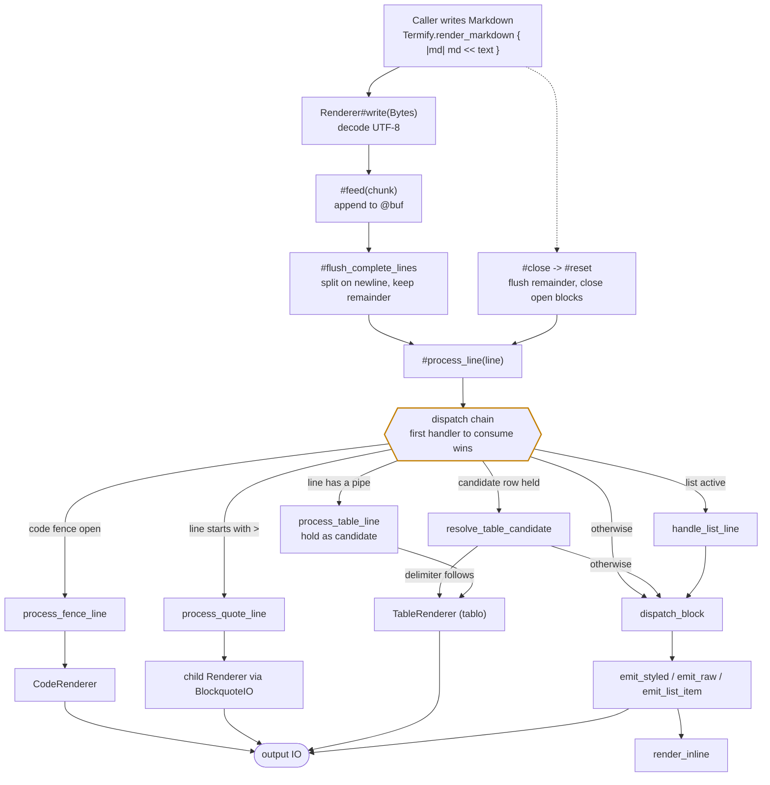
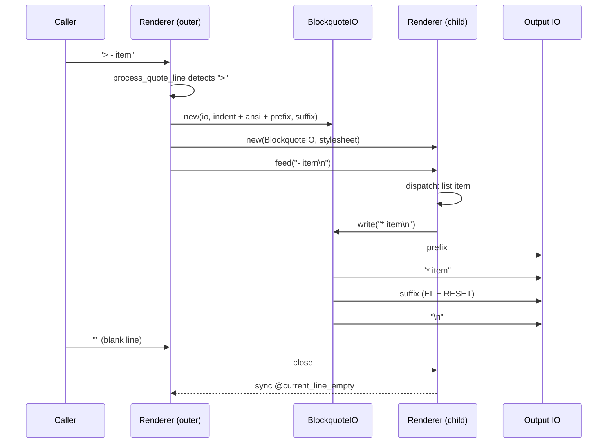
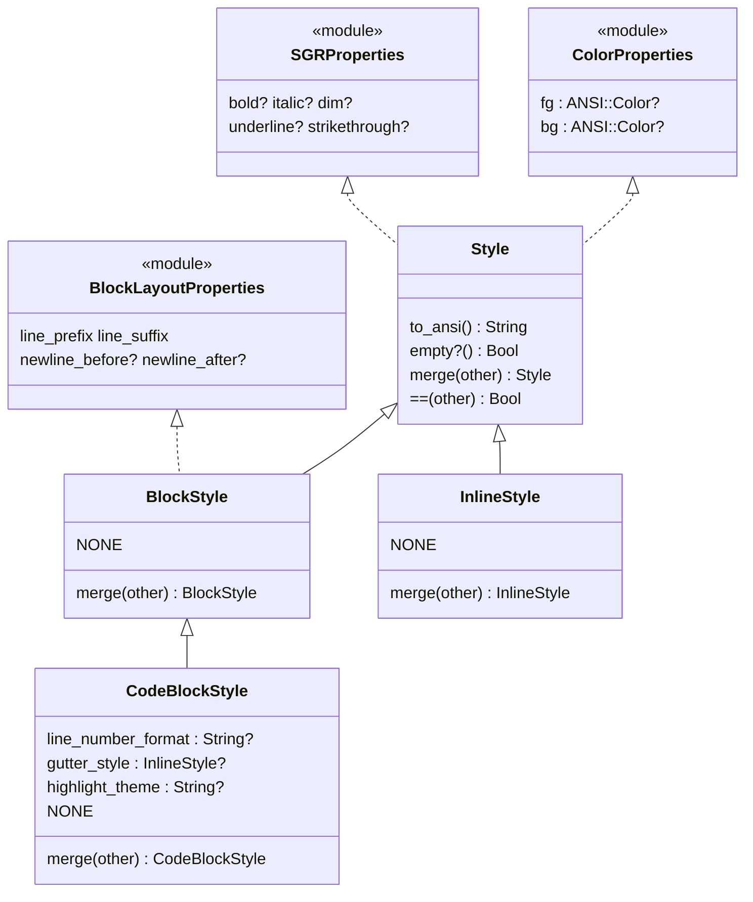
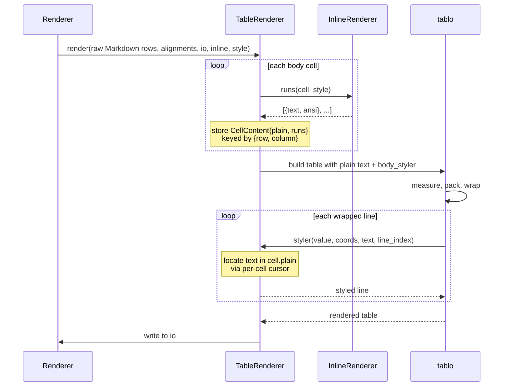

# Termify Design

The state of the design, in present tense. Build and test instructions live in
[DEVELOPMENT.md](./DEVELOPMENT.md); outstanding work lives in [SCOPE.md](./SCOPE.md).

If a sentence here would become false after a refactor, it belongs in the git log
instead.

---

## 1. The shape of the thing

Termify is a Markdown-to-ANSI renderer built as a pipe, not a parser. There is no
document tree. Text goes in one end, styled terminal output comes out the other,
and the renderer holds just enough state to know what kind of block it is in the
middle of.

The analogy is a **typesetter reading a manuscript over someone's shoulder**: it
cannot see the next page, so it decides how to set each line as the line arrives,
carrying only a small amount of context about what it has already set.

This buys streaming — output appears as input arrives — at the cost of anything
requiring lookahead. See [Appendix A](#appendix-a--deliberately-unsupported).

The shard has two halves that share nothing but the `ANSI` module:

- `Termify::Markdown` -- the renderer and its style system.
- `Termify::ANSI` and `Termify::Terminal` -- terminal control primitives, usable
  on their own without touching Markdown at all.

### Where streaming yields

"Line by line" is the rule, not an absolute. Three constructs cannot be resolved
from a single line, and each buys back exactly as much lookahead as it needs and
no more. The typesetter, in other words, is allowed to hold a line face-down on
the desk — but only for as long as it takes to settle a specific question.

Construct                      |Held back           |Until                |Because                                                                                                                                                                             
-------------------------------|--------------------|---------------------|------------------------------------------------------------------------------------------------------------------------------------------------------------------------------------
Table detection                |One line            |The next line arrives|`a \| b` is a table row or a sentence depending entirely on whether a delimiter row follows. Nothing in the line itself can tell them apart.                                        
Code fence, highlighter enabled|The whole fence body|The closing marker   |Tartrazine lexers resolve multi-line constructs (block comments, template literals) across the whole block. Some use a single `dot_all` regex and cannot be resumed per line at all.
Table rendering                |All rows            |The table ends       |Column widths are a function of every cell, so tablo cannot lay out row one until it has seen row *n*.                                                                              

Everything else — headings, paragraphs, lists, blockquotes, rules, and fences with
no highlighter — emits as soon as the line is complete.

Two properties keep this honest. **The bound is always explicit**: one line, one
fence, one table, never "until convenient". And **each exception degrades to
streaming** when its reason does not apply — a fence with no `highlight_theme`
emits immediately, and a candidate row with no delimiter behind it is released as
a paragraph on the very next line.

---

## 2. Rendering pipeline



Two properties of this chain matter:

- **It is ordered, and the order is the grammar.** A fence body is never examined
  for list syntax because `process_fence_line` consumes it first. There is no
  precedence table anywhere else; `process_line` *is* the precedence table.
- **Every handler returns `Bool`** -- true means consumed, false means fall
  through. `dispatch_block` is the terminal case and always consumes.
- **A held table candidate is resolved before anything else** can see the line,
  second only to the fence check. Only the immediately following line can confirm
  or release it, so any handler that consumed that line first -- a blockquote, say
  -- would strand the candidate indefinitely.

`dispatch_continuation` is the same chain minus the list check, used for indented
blocks inside a list item so a nested fence or table is not mistaken for a new item.

---

## 3. IO composition

`Renderer` subclasses `IO`. That is the load-bearing decision in the whole shard:
any API that accepts an `IO` can target the renderer, and — more usefully — the
renderer can target *another wrapper* without knowing it.

Blockquotes exploit this. Rather than teaching every block type about quote
prefixes, a blockquote opens a **child `Renderer` writing through a
`BlockquoteIO`**, which injects the prefix at each line start. The child renders
lists, tables and fences in blissful ignorance of the `| ` in front of them.



Nesting is just recursion: a `> > quote` produces a child of a child. The one
subtlety is the suffix, covered under [background fill](#5-background-fill) below.

---

## 4. Block boundaries and margins

Vertical spacing is expressed as two booleans per block style — `newline_before`
and `newline_after` — rather than as literal prefix strings. The renderer collapses
them so that adjacent blocks never produce more than one blank line:

- `open_block(element)` fires when the first line of a new block arrives. It ORs
  the outgoing block's `newline_after?` with the incoming block's
  `newline_before?` and emits at most one newline.
- `close_block(nil)` fires at end of document and emits the final
  `newline_after` if one is owed.
- `@current_line_empty` tracks whether the last thing written was a blank line, so
  a blank line already present in the source is not doubled by a margin flag.

Blank lines are **separators, not blocks**. `@current_block` survives them, which
is what allows a paragraph interrupted by a blank line to keep its identity.

---

## 5. Background fill

A background colour set on a block style stops at the last character unless the
line is explicitly erased to the terminal edge. Every emit path therefore writes
`ANSI::ERASE_LINE` (`\e[K`) before `ANSI::RESET` when `bg` is set:
`emit_styled`, `emit_raw`, `emit_list_item`, and `CodeRenderer#emit_plain_line`.

Blockquotes are the awkward case. `BlockquoteIO` emits `EL + RESET` as its suffix,
but **only the outermost wrapper does so**; inner wrappers use an empty suffix.
An inner `RESET` firing before the outer `EL` would clear the background, and the
outer erase would then fill with the terminal default rather than the intended
colour. See [Appendix B](#appendix-b--traps).

---

## 6. Style system



Rules that hold across the hierarchy:

- **Merge is a layering, not a replacement.** Boolean flags OR (either side may
  request an attribute); nilable fields prefer `other` when non-nil. `merge`
  return types are covariant, so merging two `BlockStyle`s yields a `BlockStyle`.
- **Equality is guarded on class.** `Style#==` returns false unless
  `self.class == other.class`, which keeps `==` commutative across the hierarchy.
  Subclasses call `super` then compare their own fields.
- **`NONE` is the canonical zero.** Lookups for unmapped elements return it rather
  than nil, so callers never branch on absence.

`Stylesheet` maps `BlockElement` and `InlineElement` to styles in two independent
hashes. Its Symbol/String constructor exists for ergonomics — `{:h1 => {bold: true}}`
— and routes `:code_block` to `CodeBlockStyle` specifically. `color_from` accepts a
named ANSI colour, a 256-colour name, or a `#rrggbb` hex string.

---

## 7. Inline rendering

`InlineRenderer` owns everything below block level. It takes a `Stylesheet` at
construction; `Renderer` holds one and delegates to it.

`#render` is a single left-to-right pass over the line's characters. There is no
tokenizer and no tree; open spans live on an `inline_stack` of
`{InlineElement, String}` pairs.

Because ANSI has no "un-bold" that composes cleanly, closing a span does not emit a
terminating code. Instead `replay_sequence` emits `RESET`, then the block style,
then every sequence still open on the stack — **the state is rebuilt from scratch
each time a span closes**. It is a stack of paint pots, not a stack of tags.

Priority, highest first: `` `code` ``, `<html>`, `[text](url)`, `**bold**`,
`~~strike~~`, `*italic*`, `_italic_`. Code spans do not nest. Link text re-enters
`#render` with the link style as its block style. Underscores between
alphanumerics are literal, so `snake_case` survives.

`#render` does not emit the block style itself — callers write it before calling
in, and `replay_sequence` re-emits it only at a span boundary. That convention is
easy to trip over; see [Appendix B](#appendix-b--traps).

### Styled runs

Some callers need to measure or wrap text before it is styled, which escape
sequences make impossible — they occupy no columns but plenty of bytes.
`#runs` returns the same content as a sequence of `Run`s instead:

```
Run = {text : String, ansi : String}
```

`text` never contains an escape, so it can be measured, wrapped and sliced.
`ansi` is the **full active sequence**, not a delta, so a run can be emitted on
its own with no memory of what preceded it. `#plain` is the runs' text joined.

Runs are derived by parsing `#render`'s output back apart, not by scanning the
markup a second time. That is deliberate: a second scanner would need its own copy
of the priority rules, the mid-word underscore exemption and the unclosed-delimiter
fallbacks, and every future fix would have to be applied twice. Parsing mirrors
`replay_sequence` exactly — `RESET` clears the active sequence, anything else
layers onto it — so the two views cannot disagree about what the markup means.

---

## 8. Tables

Tables are the one place where layout and styling have to be separated, because
the layout engine is tablo and tablo measures the strings it is given. An escape
sequence would be counted as visible width, and every styled column would come out
too narrow.

The way through is that **tablo styles after it measures**. `Cell#render_subcell`
computes alignment spacing from the wrapped text, then calls the styler on it. So
tablo can be handed plain text for layout and asked to apply our ANSI at the end.



Two consequences worth knowing:

- **Cells are buffered as raw Markdown.** `buffer_table_row` stores the source
  text; inline markup is resolved inside `TableRenderer`. Resolving it earlier
  would only have to be undone.
- **The cursor is positional, not semantic.** Tablo hands back a wrapped line but
  not where it sits in the cell, so `restyle` keeps a per-cell offset, resets it
  when `line_index` is 0, and locates each line from there. Wrapping is
  sequential, which makes the search unambiguous even when a word repeats. A line
  that cannot be placed is returned unstyled rather than styled in the wrong
  place — which also covers the truncation indicator, since that arrives through
  the same callback and is not cell text at all.

Header cells have their markup resolved but are styled uniformly bold rather than
per-run. See [Appendix A](#appendix-a--deliberately-unsupported).

The behaviours this depends on are pinned by canary specs in
`spec/termify/markdown/renderer/tablo_canary_spec.cr`. They do not test Termify —
they fail when a tablo upgrade changes something underneath us, which is cheaper
than discovering it through mangled output.

---

## 9. Code fences

`CodeRenderer` is instantiated when a fence opens, fed one body line at a time, and
closed at the terminating marker. `@fence_indent` is captured at open so indented
fences inside list items can have their body de-indented — and is patched after
`dispatch_continuation` when the fence opens mid-list, since the continuation line
was already stripped.

There are two highlighting paths:

- **Buffering (default).** Lines accumulate; `close` joins them and runs the whole
  block through tartrazine. Correct for every lexer.
- **Streaming (`-Dstreaming_highlight`).** Per line, carrying `state_stack` across
  calls via a monkeypatched `Tartrazine::Ansi#format_line`. Works only for lexers
  built on push/pop state machines. Experimental.

With no `highlight_theme`, or an unknown language, both paths fall back to plain
styled output emitted immediately.

---

## 10. Terminal and ANSI

`ANSI` holds the sequences and the colour helpers. Its sub-modules — `Cursor`,
`Screen`, `Clear`, `Mouse` — are **not** included into `ANSI`; callers use
`ANSI::Cursor.up(3)`. Method names omit a redundant prefix because the module
already supplies the context.

`Termify.terminal` memoises a platform-specific singleton, selected at compile time
by ``. `TerminalCommon` holds the shared
behaviour; `UnixTerminal` implements `with_raw_input` via `tcgetattr`/`tcsetattr`,
`WindowsTerminal` via console modes plus a `FlushConsoleInputBuffer` before yielding
so queued input cannot corrupt the `\e[6n` cursor-position reply.

`ANSI::SubScroller` constrains output to a fixed-height scroll region: `start`
reserves lines, queries the cursor row, and sets the region; `stop` restores
full-screen scrolling. Height is clamped to 3..10.

---

## Appendix A -- Deliberately unsupported

Not supported                                                                     |Why                                                                                                                                                                                                
----------------------------------------------------------------------------------|---------------------------------------------------------------------------------------------------------------------------------------------------------------------------------------------------
Lookahead-dependent Markdown (reference links, setext headings, lazy continuation)|The renderer is a one-pass pipe; buffering the document to support these would forfeit streaming, which is the point of the shard.                                                                 
Loose-list blank lines                                                            |Blank lines between continuation blocks are swallowed. Preserving them needs a clear use case first; guessing produces worse spacing than dropping.                                                
Column-width-aware table indentation                                              |Indentation is a per-line string prefix. Doing it properly requires tablo to expose width negotiation.                                                                                             
Per-run styling of table header cells                                             |Headers have their markup resolved but are styled uniformly bold. Styling them per-run would mean relying on what `coords.row_index` means for a header row, which tablo does not document.        
`block_prefix` / `block_suffix` style fields                                      |No concrete use case for non-newline block decoration has emerged. Revisit if one does.                                                                                                            
Streaming highlight for `dot_all` lexers                                          |Tartrazine's JS lexer matches block comments with a single multi-line regex rather than push/pop state, so per-line resumption cannot work. Buffering is correct for all lexers and is the default.
Platforms other than Linux, macOS and Windows                                     |`Terminal` needs platform termios or console APIs. Unsupported targets should fail at compile time.                                                                                                
Fiber-safe `Termify.terminal`                                                     |The singleton is memoised without a lock. Single-threaded use is safe; under `--threads` it is not. Not worth a mutex until someone needs it.                                                      
Markdown *output* or round-tripping                                               |Terminal rendering only. There is no AST to serialise back.                                                                                                                                        

---

## Appendix B -- Traps

Things that cost a session once. Each entry leads with the symptom, so the
situation is recognisable when it recurs.

**Symptom: a module-level method exists but the call fails to compile.**
`include` does not forward `def self.*` methods — they stay on the defining module.
`ANSI.cursor_up` cannot work merely because `Cursor` was included into `ANSI`;
`ANSI::Cursor.up` is the only valid call site.

**Symptom: a nested blockquote's background stops mid-line, or fills with the
terminal default.** An inner `BlockquoteIO` emitted a suffix. Only the outermost
wrapper may emit `EL + RESET`; inner ones must use an empty suffix so the
background is still active when the outer erase fires.

**Symptom: multi-line constructs lose their highlight state at each line
boundary.** `Tokenizer.new` runs `ensure_nl`, which injects a `\n`; if that
newline is unmatched in the current lexer state, the fallback resets
`state_stack` to `["root"]`. Passing `secondary: true` skips that branch.

**Symptom: a confusing error at macro expansion time.** Use ``,
not a bare `raise`, for compile-time errors. Bare `raise` in a macro branch is
runtime code and surfaces at program start instead.

**Symptom: a `WindowsTerminal` override is silently ignored.** Methods intended for
override must be instance methods, not class methods — `color_supported?` was
originally a class method and inheritance did not apply.

**Symptom: a spec comparing rendered output fails on a trailing newline.**
Crystal's `String#lines` strips trailing newlines. Do not compare against a
`"\n"`-suffixed expectation.

**Symptom: `out` used as a variable name fails to parse.** It is a reserved word in
Crystal. Use `buf` for a `String::Builder`.

**Symptom: a fence inside a list item never closes.** `@fence_indent` was set from
an already-lstripped continuation line. It must be patched with the real indent
after `dispatch_continuation`.

**Symptom: the first styled span in a line loses the block style, but later ones
keep it.** `InlineRenderer#render` does not emit the block style — the caller does,
before calling in — and `replay_sequence` only re-emits it once a span closes.
Anything consuming the rendered output directly, `#runs` included, has to seed the
block style itself.

**Symptom: table columns come out too narrow, or wrap where they should not.**
Something styled reached tablo before it measured. Tablo counts escape bytes as
visible width; cells must be handed plain text and styled in the styler callback.

**Symptom: table styling disappears when output is piped.** Tablo suppresses
stylers unless `STDOUT` is a tty. `TableRenderer` sets `Tablo::Config.styler_tty_only`
to false around its render, because the caller supplies the IO and so the caller,
not tablo, decides where output is going.

**Symptom: background colour codes look wrong by ten.** `Colorize::ColorANSI` enum
values *are* the ANSI foreground codes; background is foreground plus ten.
